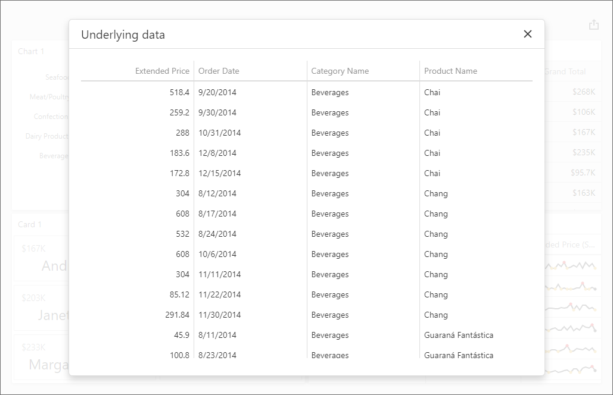

<!-- default badges list -->

<!-- default badges end -->
# Dashboard for MVC - How to obtain a dashboard item's underlying data for a clicked visual element

The example uses the Dashboard Control's [client-side API](https://docs.devexpress.com/Dashboard/16796) to get underlying data that corresponds to a particular visual element.

In this example, the [`ViewerApiExtensionOptions.onItemClick`](https://docs.devexpress.com/Dashboard/js-DevExpress.Dashboard.ViewerApiExtensionOptions?p=netframework#js_devexpress_dashboard_viewerapiextensionoptions_onitemclick) event is handled to obtain underlying data and invoke the [`dxPopup`](https://js.devexpress.com/DevExtreme/ApiReference/UI_Components/dxPopup/) widget with the child [`dxDataGrid`](https://js.devexpress.com/DevExtreme/ApiReference/UI_Components/dxDataGrid/). In the event handler, the [`e.requestUnderlyingData`](https://docs.devexpress.com/Dashboard/js-DevExpress.Dashboard.ItemClickEventArgs?p=netframework#js_devexpress_dashboard_itemclickeventargs_requestunderlyingdata) method returns records from the dashboard's data source. The `dxDataGrid` displays these records.

## Files to Look At

- [UnderlyingData.js](./CS/MvcDashboard_UnderlyingData/Scripts/UnderlyingData.js)
- [Index.cshtml](./CS/MvcDashboard_UnderlyingData/Views/Index.cshtml)
- [_Layout.cshtml](./CS/MvcDashboard_UnderlyingData/Views/Shared/_Layout.cshtml)

## Documentation

- [Client-Side API Overview for ASP.NET MVC Dashboard](https://docs.devexpress.com/Dashboard/16796/web-dashboard/aspnet-mvc-dashboard-extension/client-side-api-overview)
- [Obtain Underlying and Displayed Data in Dashboard Control for JavaScript Applications](https://docs.devexpress.com/Dashboard/403003/web-dashboard/dashboard-control-for-javascript-applications-jquery-knockout-etc/obtain-underlying-and-displayed-data)

## More Examples

- [Dashboard for Web Forms - How to get data from a clicked dashboard item](https://github.com/DevExpress-Examples/web-dashboard-get-item-data-on-click)
- [Dashboard for Web Forms - How to obtain a dashboard item's underlying data for a clicked visual element](https://github.com/DevExpress-Examples/aspxdashboard-how-to-obtain-a-dashboard-items-underlying-data-for-a-clicked-visual-element-t492257)
- [Dashboard for Web Forms - How to obtain underlying data for the specified dashboard item](https://github.com/DevExpress-Examples/aspxdashboard-how-to-obtain-underlying-data-for-the-specified-dashboard-item-t518504)
- [Dashboard for ASP.NET Core - How to obtain a dashboard item's client data](https://github.com/DevExpress-Examples/asp-net-core-dashboard-get-client-data)
- [Dashboard for ASP.NET Core  - How to obtain a dashboard item's underlying data for a clicked visual element](https://github.com/DevExpress-Examples/asp-net-core-dashboard-get-underlying-data-for-clicked-item)
- [Dashboard for ASP.NET Core  - How to obtain underlying data for the specified dashboard item](https://github.com/DevExpress-Examples/asp-net-core-dashboard-display-item-underlying-data)
